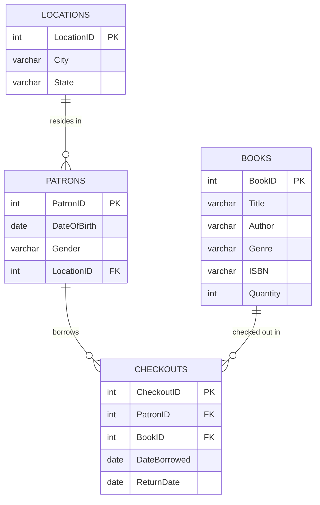

---

---

## Related
- [[SQL Day 6.md]] — normalization principles applied in this ERD
- [[SQL - Foundations, Datatypes, and ERD]] — ERD concept introduced here
- [[SQL - Keys, Relationships, and Constraints]] — primary and foreign key relationships shown in this diagram
- [[Final Project Part 1 Code Space]] — Part 1 and Part 2 are companion projects
- [[SQL Course]] — course overview