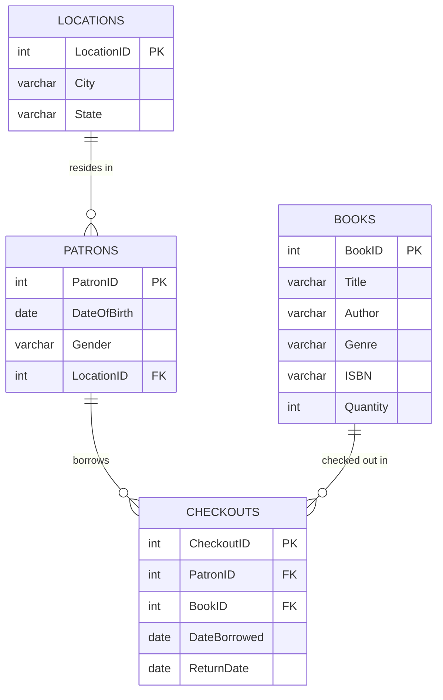

---

---

```mermaid
erDiagram
    LOCATIONS {
        int LocationID PK
        varchar City
        varchar State
    }

    PATRONS {
        int PatronID PK
        date DateOfBirth
        varchar Gender
        int LocationID FK
    }

    BOOKS {
        int BookID PK
        varchar Title
        varchar Author
        varchar Genre
        varchar ISBN
        int Quantity
    }

    CHECKOUTS {
        int CheckoutID PK
        int PatronID FK
        int BookID FK
        date DateBorrowed
        date ReturnDate
    }

    LOCATIONS ||--o{ PATRONS : "resides in"
    PATRONS ||--o{ CHECKOUTS : "borrows"
    BOOKS ||--o{ CHECKOUTS : "checked out in"
```