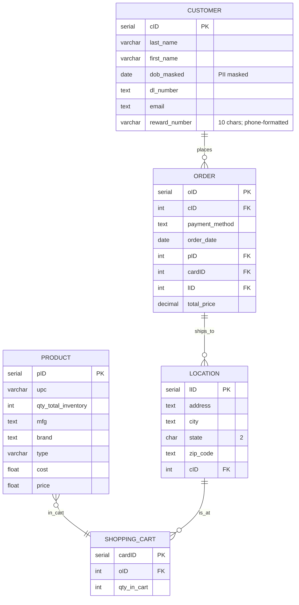

---

---
Intent: Understand basics of databases, what SQL is, and relational databases

Key Terms:

- Entity Relationship Diagram (ERD):
    - Visual model of a database
- Create, Read (Query), Update, Delete (CRUD):
    - True for all languages, it is programming agnostic
- Relational Database Model (RDBM)
    - A diagram visually showing how a database works between tables, relationships, etc.
    - Tables and rows = structure
    - Opposite: Non-relational Database
- Datatypes
    - Ways that data can be stored, core to the language, do this in CAPS, allows for scaling, security, and efficiency based on type of data
    - List of Datatypes:
        - SERIAL
            - Special to PostgreSQL, used for automatically enumerated IDs
        - VARCHAR
            - Alphanumeric, can control size (1 - n)
            - Data can be any length between those sizes
            - Ex: 
```sql
VARCHAR(20) -- This will limit the alphanumeric entry from 1 to 20 characters
```
        - CHAR
            - Alphanumeric, can control size
            - Data must be the exact size
            - If the data is below the correct size, it pads it with a space.
            - What happens if it’s above the correct?
        - TEXT
            - Alphanumeric, unlimited size
            - Best for when you don’t know the caps of the data
        - INT
            - Whole numbers without decimals
        - FLOAT
            - Decimal number storage, with a modifier that determines significant digit limits. Significant digits are all numbers before and after decimal point.
            - Ex:
```sql
FLOAT(5) -- Allows you to store data at 5 significant digits.
```
Here's an example of how FLOAT(5) could be used in SQL code:
```sql
-- Creating a table with a FLOAT(5) column
CREATE TABLE products (
    id SERIAL,
    name VARCHAR(50),
    price FLOAT(5)
);

-- Inserting data with FLOAT(5) values
INSERT INTO products (name, price) VALUES ('Widget', 12.34);
INSERT INTO products (name, price) VALUES ('Gadget', 456.78);
INSERT INTO products (name, price) VALUES ('Tool', 9.9876);

-- Valid examples for FLOAT(5): 12.34, 456.78, 9.9876
-- (All have 5 or fewer significant digits total)
```
Remember that FLOAT(5) limits the total number of significant digits to 5, counting all digits before and after the decimal point.


**Liquor Store Example:**


## Related
- [[SQL Course]] — course overview
- [[Keys, Relationships, and Constraints]] — builds on Day 1 with keys and relationships
- [[Basic Queries and SQL Commands]] — applies Day 1 concepts with SELECT queries
- [[Spring JPA Overview - Annotations]] — JPA maps Java classes to SQL tables and datatypes