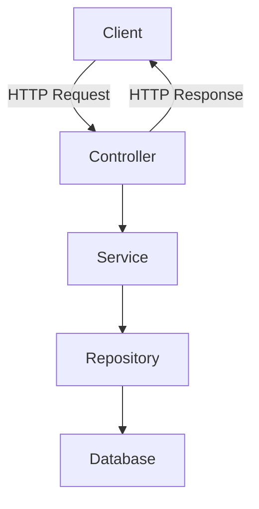

---

---
### Overview

- **Spring Framework** is a widely used Java framework for building applications (especially web apps).
- It provides the “plumbing” so your code can stay focused on business logic.
- Big benefits: **flexibility**, **extensibility**, and **testability**.
- Reference: [Spring Framework Overview](https://docs.spring.io/spring-framework/reference/overview.html)

---

### Core idea: IoC + DI (how Spring “wires” your app)

Spring helps assemble your app using:

- **Inversion of Control (IoC):** your code does not manually create and connect objects.
- **Dependency Injection (DI):** Spring *provides* the objects your classes depend on.

**High-level flow**

1. **Business objects (POJOs)**
    - Your plain Java classes (they can be “Spring-aware” via annotations, but they do not need to know *how* dependencies are created).
2. **Configuration metadata**
    - Instructions for wiring: annotations, Java config, or XML.
3. **Spring Container (IoC Container / ApplicationContext)**
    - Creates objects (**beans**)
    - Injects dependencies
    - Manages lifecycle
    - Can provide cross-cutting features (transactions, security, etc.)
4. **Fully configured system**
    - Components collaborate without manually new-ing up dependencies.

Key takeaway: **DI makes code easier to swap, test, and maintain**.

---

### Spring Web request flow (Controller → Service → Repository)



**Responsibilities by layer**

5. **@RestController / @Controller**
    - Entry point for HTTP requests
    - Translates request → service call → response
    - Keep controllers “skinny” (little business logic)
    - Commonly tested with **MockMvc** using `@WebMvcTest`
6. **@Service**
    - Business logic, validation, orchestration
    - Often tested with **Mockito** (unit tests)
7. **@Repository** (Spring Data)
    - Data access / persistence
    - Spring Data can auto-generate implementations for repository interfaces
    - Custom query tests often use `@DataJpaTest` (or `@SpringBootTest` for broader integration)
8. **@Entity**
    - Maps Java objects to database tables/columns
    - Needs an `@Id` field (primary key)

---

### HTTP methods and CRUD (quick mapping)

- **GET**: read a resource (Retrieve)
- **POST**: create a new resource (Create)
- **PUT / PATCH**: update an existing resource (Update)
    - PUT is typically full replace, PATCH is partial update
- **DELETE**: delete a resource (Delete)

---

### Common Spring MVC annotations (what we used)

- `@RestController`
    - Controller that returns data (usually JSON), not HTML views.
- `@RequestMapping("/base/path")`
    - Base route for a controller (prefixes all endpoints in that class).
- `@GetMapping`, `@PostMapping`, `@PutMapping`, `@PatchMapping`, `@DeleteMapping`
    - HTTP method-specific route mappings.
- `@PathVariable`
    - Reads a value from the URL path (example: `/api/books/42`).
- `@RequestBody`
    - Reads JSON body and converts it into a Java object.
- `@Valid`
    - Triggers Bean Validation (Jakarta Validation) on the incoming DTO.
- `@AuthenticationPrincipal`
    - Injects the authenticated user (when Spring Security is configured).

---

### Example: Controller (constructor injection)

```java
@RestController
@RequestMapping("/api/soldier")
public class SoldierController {

	private final SoldierService soldierService;

	public SoldierController(SoldierService soldierService) {
		this.soldierService = soldierService;
	}

	@GetMapping("/{id}")
	public ResponseEntity<SoldierDTO> findSoldierById(@PathVariable Long id) {
		SoldierDTO soldier = soldierService.findById(id);
		return ResponseEntity.ok(soldier);
	}

	@PostMapping
	public ResponseEntity<SoldierDTO> createSoldier(
			@RequestBody @Valid SoldierDTO newSoldierDTO,
			@AuthenticationPrincipal OidcUser oidcUser
	) {
		SoldierDTO created = soldierService.createSoldier(newSoldierDTO, oidcUser);
		return ResponseEntity.status(HttpStatus.CREATED).body(created);
	}
}
```

---

### Example: Service

```java
@Service
public class SoldierService {

	private final SoldierRepository soldierRepository;

	public SoldierService(SoldierRepository soldierRepository) {
		this.soldierRepository = soldierRepository;
	}

	public Long add(Soldier soldier) {
		return soldierRepository.saveNewSoldier(soldier);
	}

	public Soldier findById(Long id) {
		return soldierRepository.findSoldierById(id);
	}
}
```

---

### Example: Repository (Spring Data)

```java
@Repository
public interface SoldierRepository extends CrudRepository<Soldier, Long> {
	List<Soldier> findAllByUic(String uic);
}
```

Notes:

- Spring Data parses method names like `findAllByUic` to generate queries.
- The entity must have a field/property named `uic`.

---

### Mini-activity: “Book” Spring Boot app (what we built)

- Create a new Spring Boot project
- Prefer **YAML** config (if prompted)
- Create a package (example used: `mil.army.moda.books.book`)

Start simple:

```java
package mil.army.moda.books.book;

public class Book {
	private String title;
	private String author;
	private Boolean isCheckedOut;
	private Integer pageCount;
	private String isbn;
	private Integer chapterCount;
}
```

Then convert to a JPA Entity (database-backed):

```java
package mil.army.moda.books.book;

import jakarta.persistence.Entity;
import jakarta.persistence.GeneratedValue;
import jakarta.persistence.Id;

@Entity
public class Book {

	@Id
	@GeneratedValue
	private Long id;

	private String title;
	private String author;
	private Boolean isCheckedOut;
	private Integer pageCount;
	private String isbn;
	private Integer chapterCount;

	public Book() {}

	public Book(String title, String author, Boolean isCheckedOut, Integer pageCount, String isbn, Integer chapterCount) {
		this.title = title;
		this.author = author;
		this.isCheckedOut = isCheckedOut;
		this.pageCount = pageCount;
		this.isbn = isbn;
		this.chapterCount = chapterCount;
	}

	// getters/setters omitted here for brevity
}
```

```java
package mil.army.moda.books.book;

import org.springframework.data.jpa.repository.JpaRepository;
import org.springframework.stereotype.Repository;

@Repository
public interface BookRepository extends JpaRepository<Book, Long> {
}
```

```java
package mil.army.moda.books.book;

import org.springframework.stereotype.Service;

@Service
public class BookService {

	private final BookRepository bookRepository;

	public BookService(BookRepository bookRepository) {
		this.bookRepository = bookRepository;
	}

	public Book saveBook(Book book) {
		return bookRepository.save(book);
	}
}
```

```java
package mil.army.moda.books.book;

import org.springframework.http.HttpStatus;
import org.springframework.web.bind.annotation.*;

@RestController
@RequestMapping("/api/book")
public class BookController {

	private final BookService bookService;

	public BookController(BookService bookService) {
		this.bookService = bookService;
	}

	@PostMapping("/save")
	@ResponseStatus(HttpStatus.OK)
	public Book saveBook(@RequestBody Book book) {
		return bookService.saveBook(book);
	}
}
```

```java
package mil.army.moda.books;

import org.springframework.boot.SpringApplication;
import org.springframework.boot.autoconfigure.SpringBootApplication;

@SpringBootApplication
public class BooksApplication {
	public static void main(String[] args) {
		SpringApplication.run(BooksApplication.class, args);
	}
}
```

---

### Testing overview (what each test type was doing)

- Use `@WebMvcTest(BookController.class)`
- Mock the service with `@MockitoBean`
- Use **MockMvc** to call the endpoint and validate the response

```java
@WebMvcTest(BookController.class)
public class BookControllerTest {
	@Autowired MockMvc mockMvc;
	@Autowired ObjectMapper objectMapper;

	@MockitoBean BookService bookService;

	@Test
	void shouldSaveNewBook() throws Exception {
		Book book = new Book("Hobbit", "Tolkien", true, 800, "123-L3045", 12);
		book.setId(1L);
		when(bookService.saveBook(any(Book.class))).thenReturn(book);

		String json = objectMapper.writeValueAsString(book);

		mockMvc.perform(post("/api/book/save")
				.contentType(MediaType.APPLICATION_JSON)
				.content(json))
			.andExpect(status().isOk())
			.andExpect(jsonPath("$.id").value(1));
	}
}
```

- Use Mockito with `@ExtendWith(MockitoExtension.class)`
- Mock the repository and verify behavior

- Use `@DataJpaTest`
- Saves to the test database and verifies persistence works

---

### JSON (why it came up)

**JSON (JavaScript Object Notation)** is a text format for structured data.

- Spring commonly **serializes** Java objects → JSON for responses
- Spring commonly **deserializes** JSON request bodies → Java objects via `@RequestBody`

---

### Gradle + Boot version note (class troubleshooting)

Some people had issues with one Spring Boot version. In this project, using:

- `org.springframework.boot` **3.4.2**

helped get `./gradlew bootRun` working reliably.

```javascript
plugins {
	id 'java'
	id 'org.springframework.boot' version '3.4.2'
	id 'io.spring.dependency-management' version '1.1.7'
}

dependencies {
	implementation 'org.springframework.boot:spring-boot-starter-web'
	implementation 'org.springframework.boot:spring-boot-starter-data-jpa'

	runtimeOnly 'com.h2database:h2'
	developmentOnly 'org.springframework.boot:spring-boot-devtools'

	testImplementation 'org.springframework.boot:spring-boot-starter-test'
	testRuntimeOnly 'org.junit.platform:junit-platform-launcher'
}

tasks.named('test') {
	useJUnitPlatform()
}
```

---

### Run check: H2 console

If you can navigate to `http://localhost:8080/h2-console`, the app is running.

---

### Things to review (from class)

- Understand the roles of **Entity vs Repository vs Database**
- Be able to explain the full flow: **Controller → Service → Repository → DB**
- Know which test style goes with which layer (MockMvc vs Mockito vs DataJpaTest)
## Related
- [[Spring JPA Overview - Annotations]] — JPA layer sits beneath the Spring service/repository pattern
- [[Introduction to TDD Arrange]] — controller, service, and repository layers each have a corresponding test type
- [[Inheritance]] — Spring relies heavily on interface implementation and class hierarchies
- [[Polymorphism]] — Spring's dependency injection uses polymorphic references
- [[_INDEX - SQL Course]] — Spring JPA maps Java objects to SQL database tables
- [[To Do Study - Self Learning]] — todo app is a direct Spring Boot application
---

### Testing Layer Summary

Each layer of the Spring stack has a corresponding test type. Knowing which to use and why is essential.

| Layer | Annotation | What Gets Loaded | Mocks Needed |
|---|---|---|---|
| Controller | `@WebMvcTest` | Web layer only (no DB) | `@MockitoBean` for Service |
| Service | `@ExtendWith(MockitoExtension.class)` | Nothing — pure unit test | `@Mock` for Repository |
| Repository | `@DataJpaTest` | JPA + in-memory DB | None |
| Full stack | `@SpringBootTest` | Entire application context | None (or selective) |

**Key rules:**
- `@WebMvcTest` — fast, tests HTTP request/response only. Always mock the service layer.
- `@DataJpaTest` — spins up an embedded DB (H2 by default). Tests that queries and schema work correctly.
- `@SpringBootTest` — slowest, most realistic. Use for integration tests that need the full context.
- Mockito unit tests — fastest of all. No Spring context loaded at all.

**Common mistake:** using `@SpringBootTest` for everything. It works but is slow and hides layer separation issues. Match the test type to the layer being tested.
